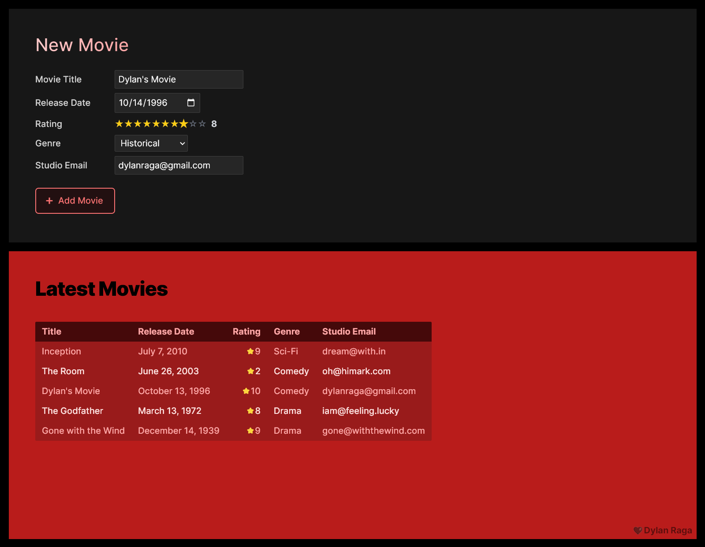

## Coding Challenge for VectorSurv

<figure>
  
  <figcaption><em>Screenshot of coding challenge UI</em></figcaption>
</figure>

### Built with


**Front-end:**

  

**Back-end:**

 

### Features

- Adding movie entries to a local JSON store (no DB setup)
- Zero boilerplate code or template styling
- Full in-line field validation via server & client
- Automatic store re-fetching on submit
- Custom Ratings selector without re-flows
- Extendable RESTful API

### Building Instructions

This project splits the back-end server `/server` and the client development server `/client`. Each has its own dependencies, so each project needs to individually be initialized and served:

```
git clone https://github.com/dylanraga/vectorsurv-coding-challenge.git
```

```
cd server
npm install
npm run dev
```

```
cd client
npm install
npm run dev
```

Since this project is built with Typescript, the code needs to first be transpiled before running in production. `ts-node` is installed as a development dependency so that this is not required when using `npm run dev`. Both folders can be compiled with `npm run build` within their respective folder. Afterwards, the server can start up via `npm run start`. Building the client compiles the resulting HTML and Javascript under `/client/dist`.
